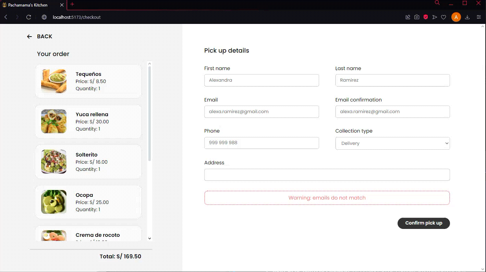
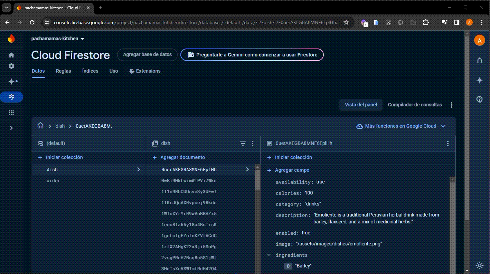
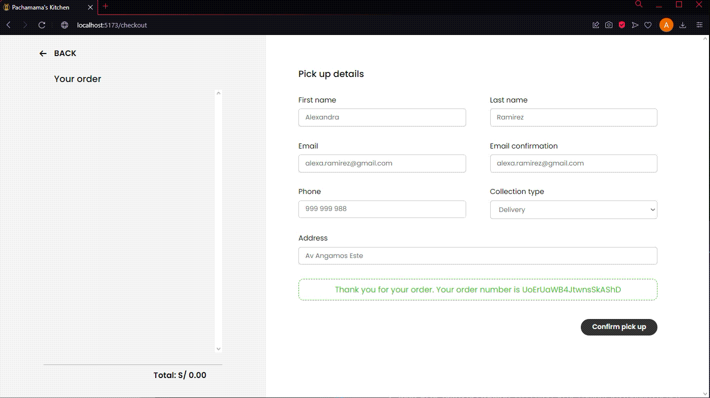

# 🍽️ Pachamama's Kitchen

Pachamama's Kitchen es un restaurante en línea de platos y bebidas peruanas, que permite a los usuarios explorar el menú, ver detalles de cada plato y agregar o eliminar elementos del carrito de compras. La aplicación está desarrollada con React para el frontend y utiliza Firebase para gestionar datos e interacciones con los usuarios.

**Consulta el prototipo aquí:** [app.uizard.io/p/88ad6ac8](https://app.uizard.io/p/88ad6ac8)

**Enlace a la aplicación:** [pachamamas-kitchen-react.vercel.app/](https://pachamamas-kitchen-react.vercel.app/)

## 📝 Funcionalidades

### 🎯 Menú
- **Categorías:** Los usuarios pueden explorar diferentes categorías de platos y bebidas, filtrando los elementos según sus preferencias.  
  

- **Detalles del plato:** Haz clic en un plato para ver más información, incluyendo ingredientes, precio y otros detalles.  
  

### 🎯 Carrito de compras
- **Agregar/Eliminar platos:** Los usuarios pueden agregar platos al carrito de compras y se pueden eliminar desde el carrito.  
  

- **Limpiar carrito:** El carrito se puede limpiar en cualquier momento, eliminando todos los elementos en una sola acción.  
  

### 🎯 Pantalla de checkout
- **Ingreso de datos del usuario:** En el proceso de compra, los usuarios deben proporcionar su información para finalizar el pedido. El formulario se asegura de que todos los datos necesarios estén correctamente completados antes de proceder.
  

- **Confirmación del pedido:** Muestra un resumen detallado del pedido. De ingresar los datos correctamente, el usuario podrá visualizar su número de orden de compra.
  

### 🎯 Cloud Firebase
- **Datos de los platos:** Los datos de los platos que antes estaban en un json, ahora están en la nube de Firebase.
  

- **Subida de la orden a Firebase:** La orden podrá ser visualizada en la nube de Firebase en la colección llamada "orden". Se podrá identificar con el ID de la orden que se entrega cuando confirmas tu compra.
  

## 🔥 Tecnologías utilizadas
- **Frontend:** React
- **Base de datos:** Firebase para la gestión de datos

## 🚀 Pasos para usar el repositorio

1. Clonar el repositorio:
   ```bash
   git clone https://github.com/AlexandraRamirezz/Pachamamas-Kitchen-react.git
     ```
2. Navega al directorio del proyecto:
   ```bash
   cd pachamamas-kitchen
    ```
3. Instalar las dependencias:
    ```bash
    npm install
      ```
4. Iniciar la aplicación:
    ```bash
    npm run dev
      ```
